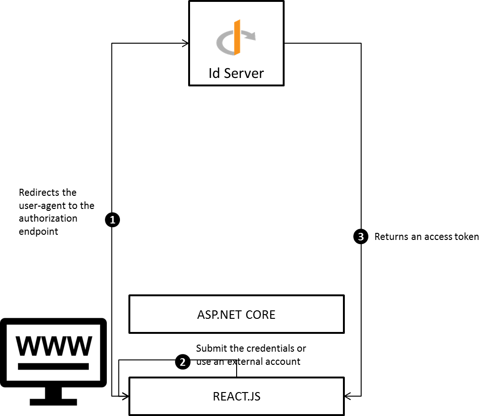
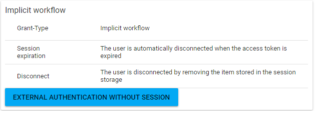

# OpenId implicit workflow (without session)

## Purpose

The objective of this tutorial is to offer the possibility to the end-users to authenticate against an ASP.NET CORE website with their local or external accounts. The grant-type used it the OAUTH2.0 [implicit](https://tools.ietf.org/html/rfc6749#section-4.2).



The REACT.JS application redirects the user-agent to the authorization endpoint.

1. The end-user authenticates with his local or external account. If the authentication is successful then an access token is returned into the query string.

2. The REACT.JS application fetches the access token from the redirection url and use the web storage API to store the session. 

3. The session lifetime is managed by the REACT.JS application. If the access token is expired then the session is removed from the (local / session) storage.

## Prerequisites

* The **idserver** database must be deployed

* The OPENID provider must be configured

## Implementation

### Add the OPENID server

Please refer to this tutorial to create a new OPENID server.

### Configure OPENID

Register a new client into the OPENID provider and set the following properties

| Property         | Value                           |
| ---------------- | ------------------------------- |
| ClientId         | Website                         |
| Grant-Type       | Implicit                        |
| Application type | web                             |
| Redirect URL     | http://localhost:64950/callback |
| Response types   | id_token token                  |

### Create website

#### REACT.JS

##### Authenticate the end-user

Create a new login page into your REACT.JS application and add a new button **external authentication**. When this button is clicked by the end-user then a new tab is opened and the authorization web page is displayed.

Before going further, the authorization url must be built by the REACT.JS application. Execute an HTTP GET request to get the well-known configuration. The base authorization url can be fetched from the ``` authorization_endpoint``` key.

```textile
Request URL : http://localhost:60000/.well-known/openid-configuration
Request Method : GET
```

Append the following queries to your authorization url : 

| Query         | Value                           |
| ------------- | ------------------------------- |
| scope         | role profile                    |
| state         | ```generate a random value```   |
| redirect_uri  | http://localhost:64950/callback |
| response_type | id_token token                  |
| ClientId      | Website                         |
| nonce         | ```generate a random value ```  |
| response_mode | query                           |

At the end the authorization url should look like to something like this : 

```textile
http://localhost:60000/authorization?scope=openid role profile&state=75BCNvRlEGHpQRCT&redirect_uri=http://localhost:64950/callback&response_type=id_token token&client_id=Website&nonce=nonce&response_mode=query
```

Once the authoriztion url is built then the tab can be opened and the REACT.JS can monitor the url to get the access token from the callback url and store this value into a local / session storage. The code below shows how to get the access token and validate the nonce and state parameters.    

```javascript
const clientId = 'Website';
const callbackUrl = 'http://localhost:64950/callback';
const stateValue = '75BCNvRlEGHpQRCT';
const nonceValue = 'nonce';
var self = this;
// Operation used to get the query parameter from the URL.
var getParameterByName = function (name, url) {
  if (!url) url = window.location.href;
  name = name.replace(/[\[\]]/g, "\\$&");
  var regex = new RegExp("[?&]" + name + "(=([^&#]*)|&|#|$)"),
  results = regex.exec(url);
  if (!results) return null;
  if (!results[2]) return '';
  return decodeURIComponent(results[2].replace(/\+/g, " "));
};
// 1. Build the authorization url.
var url = "http://localhost:60000/authorization?scope=openid role "+
    "profile&state="+stateValue+"&redirect_uri="+ callbackUrl + 
    "&response_type=id_token token&client_id=" + clientId + 
    "&nonce=" + nonceValue +
    "&response_mode=query";
// 2. Open the authorization url into a new tab.
var w = window.open(url, '_blank');
// 3. Periodically check the session
var interval = setInterval(function () {
  if (w.closed) {
    clearInterval(interval);
    return;
  }

  var href = w.location.href;
  // 4. Get the informations from the callback url.
  var accessToken = getParameterByName('access_token', href);
  var idToken = getParameterByName('id_token', href);
  var state = getParameterByName('state', href);
  if (!idToken && !accessToken) {
      return;
  }

  // 5. Check the state
  if (state !== stateValue) {
      return;
  }

  var payload = JSON.parse(window.atob(idToken.split('.')[1]));
  // 6. Check the nonce.
  if (payload.nonce !== nonceValue) {
      return;
  }

  // 7. The end-user is authenticated
  sessionStorage.setItem('session', { access_token: accessToken, id_token: idToken });
  clearInterval(interval);
});
```

1. Build the authorization url. Add the nonce, state, client identifier and callback url into the queries.

2. Open the authorization webpage into a new tab.

3. Perdiodically check the validity of the access token.

4. Parse the callback url to get the access, identity tokens and the state.

5. Check if the state received in the callback url is the same than the one passed into the request.

6. Check if the nonce fetched from the identity token is the same than the one passed into the request.

7. Add the session into the session storage

   Once the session is saved into the session storage. Use the code below the check its validity.

```javascript
// 1. Import the moment library
import moment from 'moment';
var self = this;
self._interval = setInterval(function () {
    // 2. Get the session from the session storage.
  var session = JSON.parse(sessionStorage.getItem('session'));
  // 3. Get the access token and the expiration time.
  var accessToken = user['access_token'];
  var accessTokenPayload = JSON.parse(window.atob(accessToken.split('.')[1]));
  var expirationTime = moment.unix(accessTokenPayload['exp']);
  var now = moment();
  // 4. Check the session.
  if (expirationTime < now) {
      clearInterval(self._interval);
    sessionStorage.removeItem('session');
  }
}, 3*1000);
```

1. Import the moment library to manipulate the time.

2. Get the session from the session storage

3. Get the access token and the expiration time from the session.

4. If the expiration time is less than the validity time then remove the session from the storage.

## Result

To run the sample application please follow the steps below :

1. Fetch the  [sample projects](https://github.com/thabart/SimpleIdentityServer.Samples.git).

2. Open the folder /SimpleIdentityServer.Samples/Migrations/```database```corresponding to the database engine (SQLSERVER, SQLITE, POSTGRE) you're using. By default the database used is **idserver**, if you're using a different one then open the ```appsetting.json``` and update the connectionString.

3. Launch the command ```dotnet run -f net461 / netcoreapp2.0```. At the end of the execution the database will be migrated and the tables will be populated.

4. Before starting the OPENID server ensure that the environment variable ```SID_MODULE``` exists and its value is set to a directory.

5. Open the folder /SimpleIdentityServer.Samples/WebsiteAuthentication and execute the command **launch.cmd**.

In a browser open the url ```http://localhost:64950``` and click on the button **EXTERNAL AUTHENTICATION WITHOUT SESSION**


