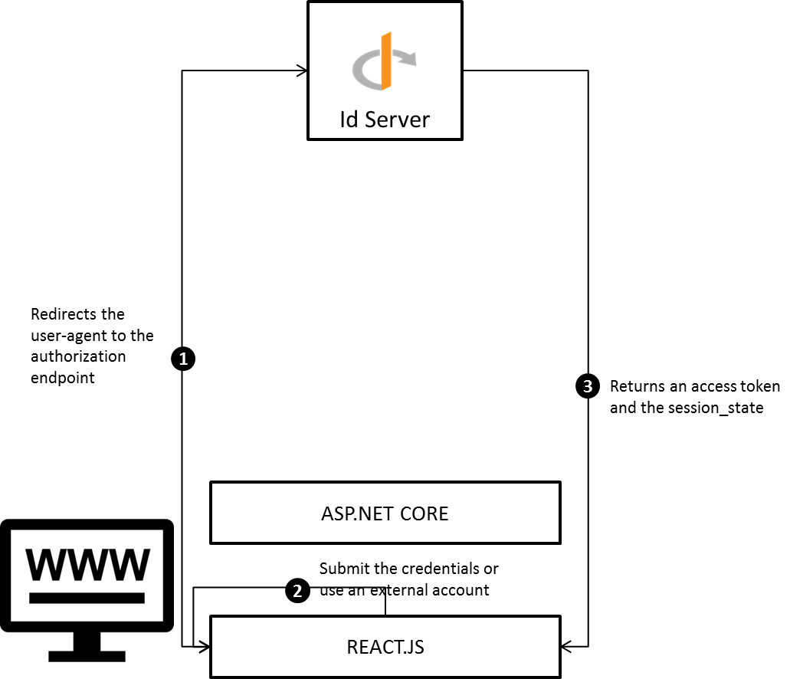
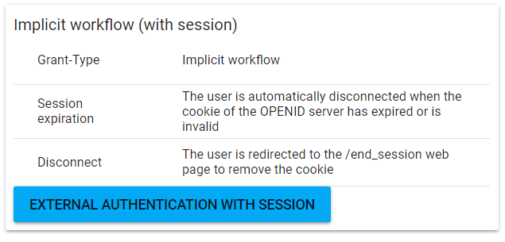

# OpenId implicit workflow (with session)

## Purpose

The objective of this tutorial is to offer the possibility to the end-users to authenticate against an ASP.NET CORE website with their local or external accounts. The difference with the previous tutorial is the lifecycle of the session is not managed by the website but by the OPENID provider via the [session management mechanism](http://openid.net/specs/openid-connect-session-1_0.html). 



1. The REACT.JS application redirects the user-agent to the authorization endpoint

2. The end-user authenticates with his local or external account. If the authentication is successful then an access token is returned into the query string with a session_state.

3. The REACT.JS application fetches the access token and the session_state from the redirection url. It periodically checks that the session is still active.

## Prerequisistes

* The **idserver** must be deployed

* The OPENID provider must be configured

## Implementation

### Add the OPENID provider

Please refer to this tutorial to create a new OPENID server

### Configure OPENID

Register a new client into the OPENID provider and set the following properties

| Property                 | Value                              |
| ------------------------ | ---------------------------------- |
| ClientId                 | Website                            |
| Grant-Type               | Implicit                           |
| Application Type         | web                                |
| Redirection URL          | http://localhost:64950/callback    |
| Response types           | id_token token                     |
| Post Logout Redirect Url | http://localhost:64950/end_session |

### Create website

#### REACT.JS

##### Authenticate the end-user

Create a new login page into your REACT.JS application and add a new button **external authentication**. When this button is clicked by the end-user then a new tab is opened and the authorization web page is displayed.

Before going further, the authorization url must be built by the REACT.JS application. Execute an HTTP GET request to get the well-known configuration. The base authorization url can be fetched from the **authorization_endpoint** key.

```textile
Request URL : http://localhost:60000/.well-known/openid-configuration
Request Method : GET
```

Append the following queries to your authorization url :

| Query         | Value                           |
| ------------- | ------------------------------- |
| scope         | role profile                    |
| state         | ```generate a random value```   |
| redirect_uri  | http://localhost:64950/callback |
| response_type | id_token token                  |
| ClientId      | Website                         |
| nonce         | ```generate a random value```   |
| response_mode | query                           |

At the end the authorization url should look like to something like this :

```textile
http://localhost:60000/authorization?scope=openid role profile&state=75BCNvRlEGHpQRCT&redirect_uri=http://localhost:64950/callback&response_type=id_token token&client_id=Website&nonce=nonce&response_mode=query
```

Once the authorization url is built then the tab can be opened and the REACT.JS can monitor the URL to get the access token and the session state from the callback url  and store those values into a local / session storage. The code below shows how to get the access token, session_state and validate the nonce and state parameters.

```javascript
const clientId = 'Website';
const callbackUrl = 'http://localhost:64950/callback';
const stateValue = '75BCNvRlEGHpQRCT';
const nonceValue = 'nonce';
var self = this;
// Get the query from the url.
var getParameterByName = function (name, url) {
  if (!url) url = window.location.href;
  name = name.replace(/[\[\]]/g, "\\$&");
  var regex = new RegExp("[?&]" + name + "(=([^&#]*)|&|#|$)"),
  results = regex.exec(url);
  if (!results) return null;
  if (!results[2]) return '';
  return decodeURIComponent(results[2].replace(/\+/g, " "));
};
// 1. Build the authorization url.
var url = "http://localhost:60000/authorization?scope=openid role "+                    "profile&state="+stateValue+"&redirect_uri="
 + callbackUrl
 + "&response_type=id_token token"
 + "&client_id=" + clientId + "&nonce=" + nonceValue +"&response_mode=query";
// 2. Open the authorization webpage into a new tab.
var w = window.open(url, '_blank');
var interval = setInterval(function () {
    if (w.closed) {
      clearInterval(interval);
    return;
  }

     // 3. Get the access, identity tokens, state and session state from the callback url.
  var href = w.location.href;
  var accessToken = getParameterByName('access_token', href);
  var idToken = getParameterByName('id_token', href);
  var state = getParameterByName('state', href);          
  var sessionState = getParameterByName('session_state', href);
  if (!idToken && !accessToken) {
      return;
  }

  // 4. Check the state.
  if (state !== stateValue) {
      return;
  }

   // 5. Check the nonce.
  var payload = JSON.parse(window.atob(idToken.split('.')[1]));
  if (payload.nonce !== nonceValue) {
      return;
  }

  // 6. Store the session into the storage
  clearInterval(interval);
  sessionStorage.setItem('session', { access_token: accessToken, id_token: idToken })
});
```

1. Build the authorization url. Add the client identifier, nonce, state and callback url into the queries

2. Open the authorization webpage into a new tab.

3. Get the access, identity tokens, state and the session state from the callback url.

4. Check if the state fetched from the callback url matches the one passed into the request

5. Check if the nonce fetched from the identity token matches the one passed into the request

6. Store the session into the storage.

Once the tokens are received, add an hidden iframe into your application with the target url : 

```textile
http://localhost:60000/check_session
```

When the iframe is loaded then periodically check the session :

```javascript
var self = this;
// This operation is called when a message has been received from the iframe.
self.handleMessage = function(e) { 
    var self = this;
  if (e.data === 'error' || e.data === 'changed') {
      sessionStorage.removeItem('session'); // Remove the session.
  }
};

// When the message is received then execute the handleMessage callback.
window.addEventListener("message", self.handleMessage, false);
// 1. Periodically check the session.
var originUrl = window.location.protocol + "//" + window.location.host;
self._interval = setInterval(function() { 
  // 2. Get the session from the storage
    var session = JSON.parse(sessionStorage.getItem('key'));
  // 3. Get the session state.
  var message = "Website "+ session['session_state'];
  // 4. Post a message to the hidden iframe
  var win = self._sessionFrame.contentWindow;
  win.postMessage(message, "http://localhost:60000");
}, 3*1000);
```

1. Periodically check the session (every 3 seconds)

2. Get the session from the storage

3. Get the session state

4. Post a the client identifier and the session state to to the check_session endpoint.

## Result

run the sample application please follow the steps below :

1. Fetch the [sample projects](https://github.com/thabart/SimpleIdentityServer.Samples.git).

2. Open the folder /SimpleIdentityServer.Samples/Migrations/```database```corresponding to the database engine (SQLSERVER, SQLITE, POSTGRE) you're using. By default the database used is **idserver**, if you're using a different one then open the ```appsetting.json``` and update the connectionString.

3. Launch the command ```dotnet run -f net461 / netcoreapp2.0```. At the end of the execution the database will be migrated and the tables will be populated.

4. Before starting the OPENID server ensure that the environment variable ```SID_MODULE``` exists and its value is set to a directory.

5. Open the folder /SimpleIdentityServer.Samples/WebsiteAuthentication and execute the command **launch.cmd**.

In a browser open the url ```http://localhost:64950``` and click on the button **EXTERNAL AUTHENTICATION WITH SESSION**


