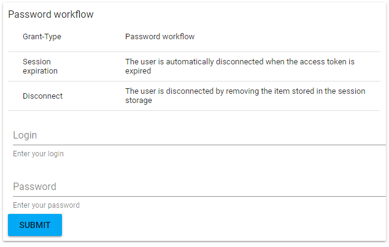

# OpenId password authentication

## Purpose

The objective of this tutorial is to offer the possibility to the end-users to authenticate with their credentials in an ASP.NET CORE REACT.JS website. The grant-type used is the OAUTH2.0 [password](https://tools.ietf.org/html/rfc6749#section-4.3). 


1. The REACT.JS tries to get an access token by passing the login and password of the end-user.

2. The ASP.NET CORE application receives the login & password and tries to get an access token by using the password grant-type.

3. The granted token is returned to the REACT.JS application. The session lifetime is managed by the REACT.JS application, if the access-token is expired then the session is removed from the (local / session) storage.

**Note : all the javascript examples have been developed with the REACT.JS framework.**

## Prerequisistes

* The ```idserver``` database must be deployed

* The OPENID provider must be configured

## Implementation

### Add the OPENID server

Please refer to this **tutorial** to create a new OPENID server

### Configure OPENID

Register a new client into the OPENID provider and set the following properties :

| Property              | Value              |
| --------------------- | ------------------ |
| Grant-Type            | Password           |
| Authentication method | Client secret post |
| Application type      | web                |

### Create website

#### ASP.NET CORE

Create a new ASP.NET core application **WebsiteAuthentication.ReactJs** and install the following nuget package

```
SimpleIdentityServer.Client 3.0.0-rc7
```

Register the SimpleIdentityServer.Client dependencies by adding the following code into the ConfigureService method in the Startup.cs file.

```csharp
services.AddIdServerClient();
```

Create a new AuthenticateRequest Data Transfer Object (DTO)

```csharp
using System.Runtime.Serialization;

namespace WebsiteAuthentication.ReactJs.DTOs
{
    [DataContract]
    public sealed class AuthenticateRequest
    {
        [DataMember(Name = "login")]
        public string Login { get; set; }
        [DataMember(Name = "password")]
        public string Password { get; set; }
    }
}
```

Add a new **Authenticate** method into the HomeController which accepts an AuthenticateRequest Data Transfer Object. 

```csharp
[HttpPost]
public async Task<IActionResult> Authenticate([FromBody] AuthenticateRequest authRequest) { }
```

And add this code into the **Authenticate** body :

```csharp
// 1. Get an access token
var grantedToken = await _identityServerClientFactory.
  CreateAuthSelector().
  UseClientSecretPostAuth(Constants.ClientId, Constants.ClientSecret)                             .UsePassword(authenticateRequest.Login,                                                                      authenticateRequest.Password,                                                                    "openid", "profile", "role")
  .ResolveAsync(Constants.OpenIdWellKnownConfiguration)
  .ConfigureAwait(false);
// 2. Check the access token.
if (grantedToken == null || string.IsNullOrWhiteSpace(grantedToken.AccessToken))
{
   return new UnauthorizedResult();
}

// 3. Return the granted token
return new OkObjectResult(grantedToken);
```

1. The [client_secret_post](http://openid.net/specs/openid-connect-core-1_0.html#ClientAuthentication) authentication method and ```password``` grant-type is used to get an access token valids on the scope  ```openid```,```profile```, ```role```. 

2. Check the access token and returns 401 error code if not valid.

3. Returns the granted token 

##### Authenticate the end-user

Create a new login page into your REACT.JS application and add a form with two fields  (login and password) and a submit button. When the form is submitted by the end-user then an HTTP POST request  is executed against the target url ```/Home/Authenticate``` and the login & password is passed into the HTTP Body.

**HTTP HEADER**

| Key         | Value              |
| ----------- | ------------------ |
| Target url  | /Home/Authenticate |
| Method Type | HTTP POST          |

**HTTP BODY**

| Key       | Value                                     |
| --------- | ----------------------------------------- |
| HTTP BODY | { login: "```login```", "```password```"} |

##### Check the session

Once the response is received, use the web storage API to store the result. Use the code below to check the session validity :

```javascript
// 1. Import the moment library
import moment from 'moment';
var self = this;
// 2. Periodically check the access token validity
self._interval = setInterval(function () {
  // 3. Get the session.
  var session  = JSON.parse(sessionStorage.getItem('session'));
  // 4. Get the access token.
  var accessToken = user['access_token'];
  // 5. Get the expiration time
  var accessTokenPayload = JSON.parse(window.atob(accessToken.split('.')[1]));
  var expirationTime = moment.unix(accessTokenPayload['exp']);
  var now = moment();
  // 6. Check the validity
    if (expirationTime < now) {.
      clearInterval(self._interval);
    sessionStorage.removeItem('session');
  }
}, 3*1000);
```

1. Import the [moment.js](https://momentjs.com/) library

2. Check every 3 seconds the session validity

3. Get the session from the session storage

4. Get the access token

5. Get the expiration time

6. Compare the expiration time with the current time. If the expiration time is less than the current time then  clear the interval and remove the session from the storage.

## Result

To run the sample application please follow the steps below :

1. Fetch the [samples projects](https://github.com/thabart/SimpleIdentityServer.Samples.git).

2. Open the folder /SimpleIdentityServer.Samples/Migrations/```database``` matching the database engine (SQLSERVER, SQLITE, POSTGRE) you're using. By default the database used is ```idserver```, if you're using a different one then open the ```appsetting.json``` and update the connectionString.

3. Launch the command  ```dotnet run -f net461 / netcoreapp2.0```. At the end of the execution the database will be migrated and the tables will be populated.

4. Before starting the OPENID server ensure that the environment variable ```SID_MODULE``` exists and its value is set to a directory.

5. Open the folder ```/SimpleIdentityServer.Samples/WebsiteAuthentication``` and execute the command ```launch.cmd```. 


